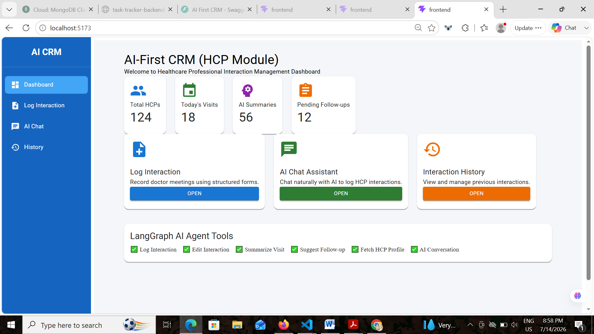
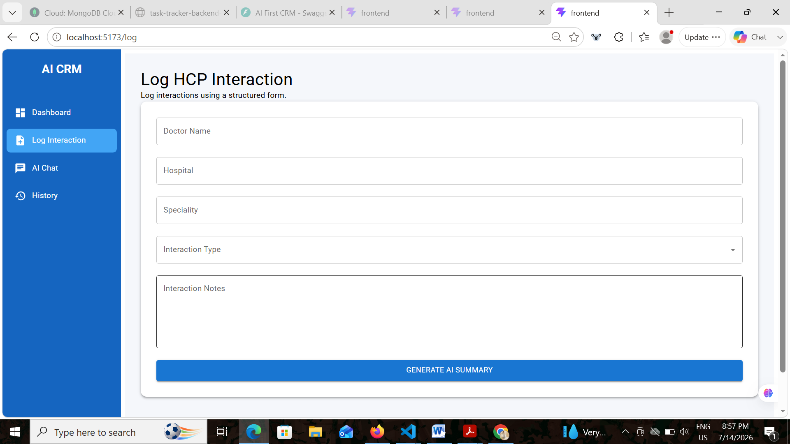
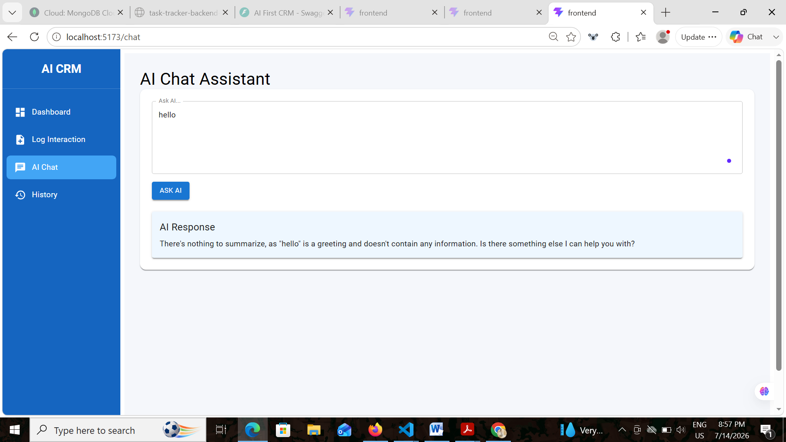
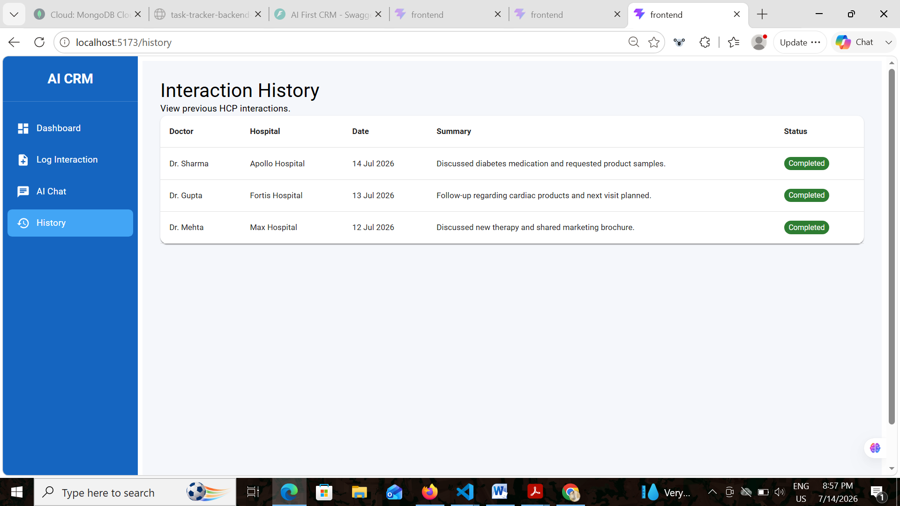

# 🧠 AI First CRM – HCP Module

An AI-powered Customer Relationship Management (CRM) system for Healthcare Professionals (HCPs). This project enables medical representatives to log interactions using a structured form or conversational AI interface powered by **LangGraph** and **Groq LLM**.

---

## 🚀 Live Demo

### 🌐 Frontend

**https://ai-first-crm-uwzz.vercel.app/**

### ⚙️ Backend API

**https://ai-first-crm-backend-gfwr.onrender.com/**

### 📚 API Documentation

**https://ai-first-crm-backend-gfwr.onrender.com/docs**

---

## ✨ Features

* 🩺 Log HCP interactions
* 🤖 AI-generated interaction summaries
* 💬 Conversational AI assistant
* ✏️ Edit logged interactions
* 👨‍⚕️ Fetch HCP profile
* 📋 Follow-up recommendations
* 📜 Interaction history dashboard

---

## 🛠️ Tech Stack

### Frontend

* React.js
* Redux Toolkit
* Material UI
* Vite

### Backend

* FastAPI
* LangGraph
* LangChain
* Groq LLM
* Python

---

## 🤖 LangGraph AI Tools

* 📝 Log Interaction
* ✏️ Edit Interaction
* 📄 Summarize Interaction
* 👨‍⚕️ Fetch HCP Profile
* 📅 Suggest Follow-up

---

## 📂 Project Structure

```text
ai-first-crm
│
├── backend
│   ├── main.py
│   ├── agent.py
│   ├── tools.py
│   ├── requirements.txt
│   └── .env.example
│
├── frontend
│   ├── src
│   ├── public
│   └── package.json
│
├── screenshots
└── README.md
```

---

## 📸 Screenshots

### 🏠 Dashboard



---

### 📝 Log Interaction



---

### 🤖 AI Chat Assistant



---

### 📜 History



---

## ⚙️ Installation

### Backend

```bash
cd backend
pip install -r requirements.txt
uvicorn main:app --reload
```

---

### Frontend

```bash
cd frontend
npm install
npm run dev
```

---

## 🔑 Environment Variables

Create a `.env` file inside the `backend` folder.

```env
GROQ_API_KEY=YOUR_GROQ_API_KEY
MODEL_NAME=llama-3.3-70b-versatile
```

---

## 📌 Assignment Highlights

* ✅ React + Redux
* ✅ FastAPI Backend
* ✅ LangGraph Agent
* ✅ Groq LLM Integration
* ✅ AI-powered CRM Workflow
* ✅ Responsive Material UI
* ✅ Live Deployment

---

## 👩‍💻 Author

**Ayushi Baliyan**

GitHub: https://github.com/ayushi-baliyan
